# Dokumentácia
# Semestrálny projekt - eshop 
Autor: Marek Petrovič

## Zadanie
Vytvorte webovú aplikáciu - eshop, ktorá komplexne rieši nižšie definované prípady použitia vo vami zvolenej doméne (napr. elektro, oblečenie, obuv, nábytok). Presný rozsah a konkretizáciu prípadov použitia si dohodnete s Vašim cvičiacim na cvičení

## Vytvorené skice rozhrania

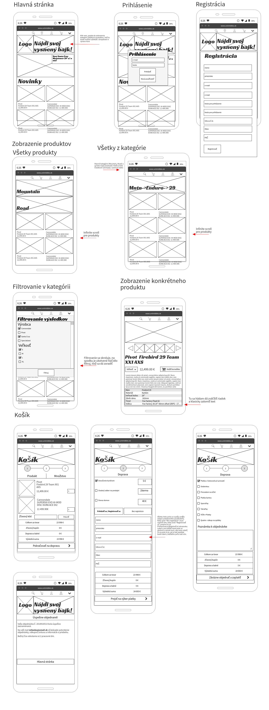

## Diagram fyzického dátového modelu

Prikladám aj v súbore FyzModel.png

Takto vyzerá po úpravách počas implementácie.

Špecialitou je nová tabuľka OneTimeUser, ktorá slúži na spojenie s objednávkou. Pôvodný úmysel bolo používať pre objednávky len tabuľku Users, pričom by sa každá objednávka spájala s skutočným používateľom systému a s jednorazovo vytvoreným na potreby archivácie dodacích údajov.Toto by však spôsobovalo problémy s prihlasovaním, keby boli obaja v tabuľke Userse. Teda vždy keď sa vytvorí nová objednávka, vytvorí sa aj nový OneTimeUser, ktorý je spojený len s touto objednávkou. Táto tabuľka teda rieši problem, keby si používateľ menil v čase svoje údaje. Takto objednávky v systéme stale zachovávajú tie údaje na ktoré boli vykonané a okrem toho sú aj spojené s používateľom v systéme, ktorý objednávku zadal. V prípade, že objednávku zadá neprihlásený používateľ, je objednávka spojená len s OneTimeUser-om.

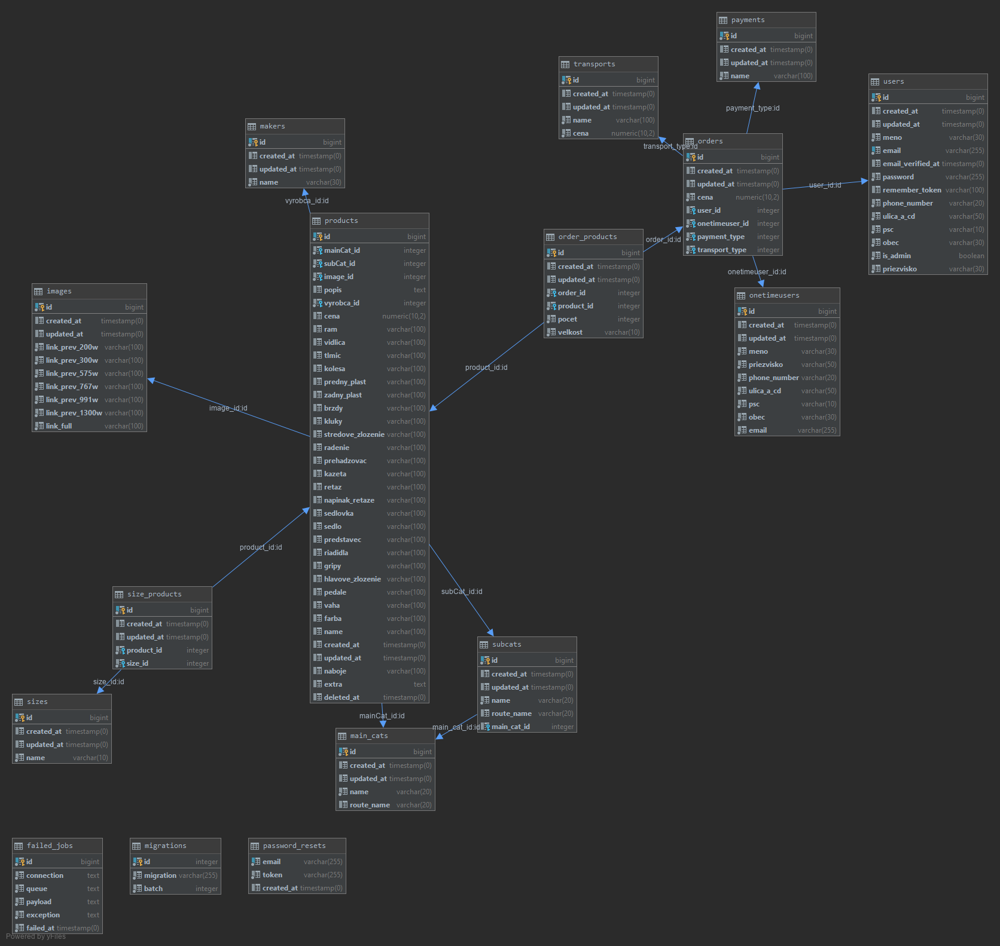

## Pôvodný diagram fyzického modelu

Vznikol, keď som ešte nevedel o poliach potrebných pre aplikáciu (soft deletes, registrácia/prihlásenia). Počas implementácie bol rozšírený (popis vyššie) o spomínané polia a tabuľky.

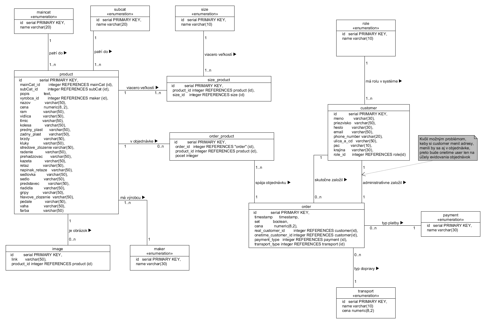

## Opis návrhu

Nastali malé zmeny voči skicám.

## Zmeny voči skicám a implementácia obrazoviek
### Klientská časť

1. Zmeny headeru
* odobratie hľadania
* odobratie lokality   
  

2. Zmeny landing page
* zmena rozloženia bannerov

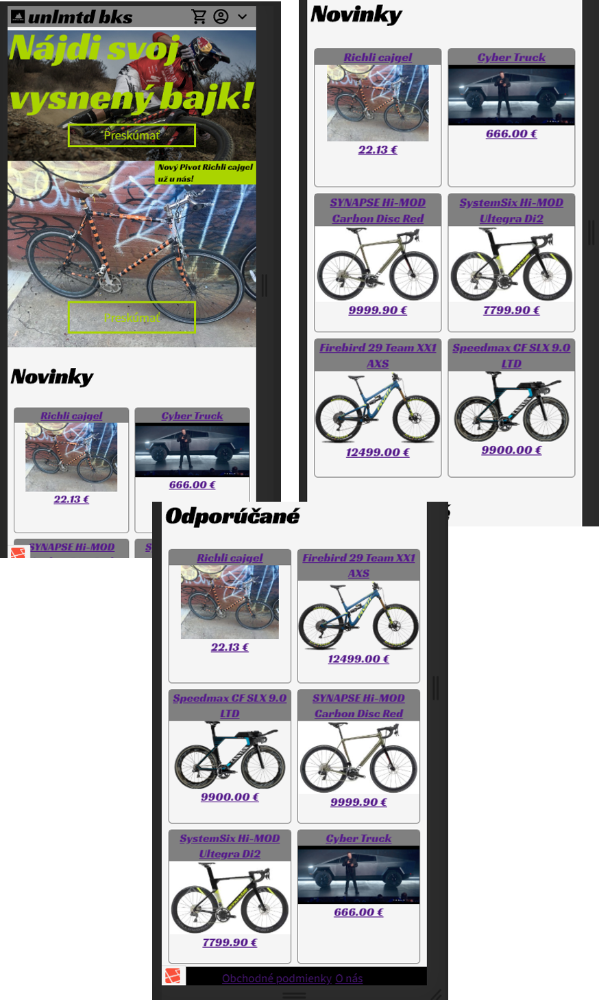

3. Zmeny výpis produktov-kategórií a filtrovanie
* umiestnený len jeden klikateľný banner, názov sa dopĺňa
* filtrovanie po kliknutí na pole filtrovať

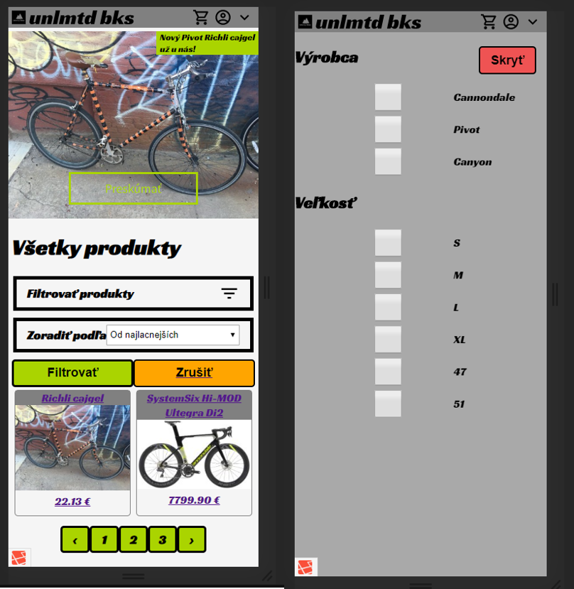

4. Obrazovky bez zmeny
* detail produktu

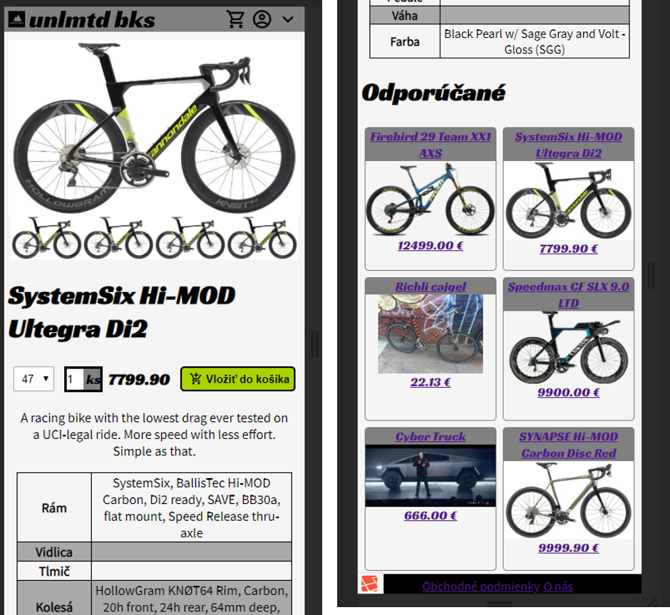

* kroky košíka
  
    Košík je postavený na ukladaní jednotlivých krokov do Session, a až keď sa potvrdí záväzné objednanie, tak sa všetko skontroluje s aktuálnym stavom databázy a ak dáta súhlasia, tak sa vytvorí objednávka a odošle.

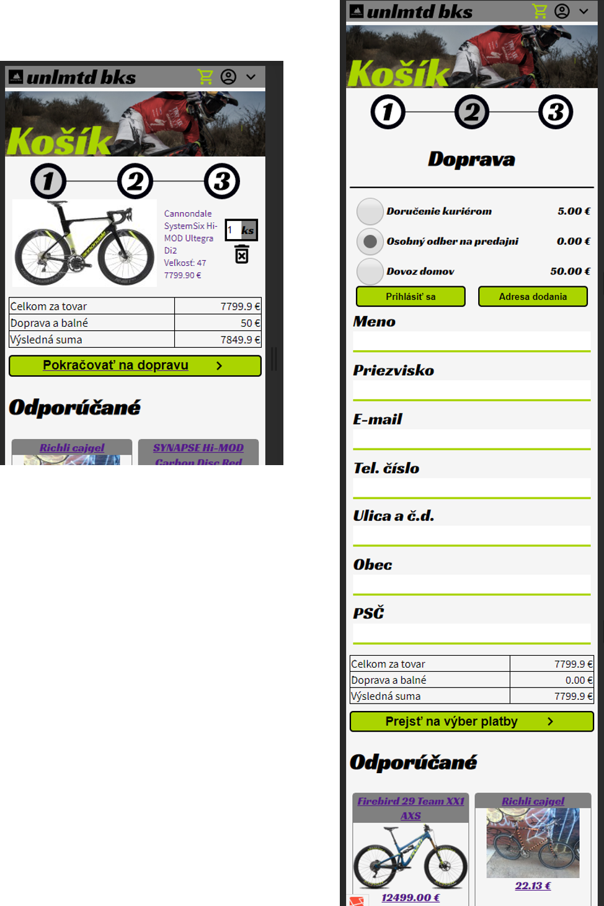
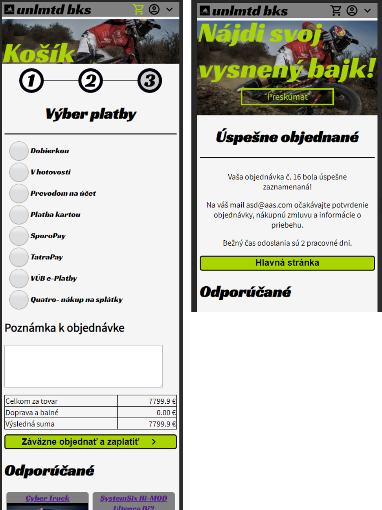

* prihlásenie odhlásenie
  
    Využitá laravel vybudovaná autentifikácia s hashovaním hesiel, prerobená na potreby mojich obrazoviek.

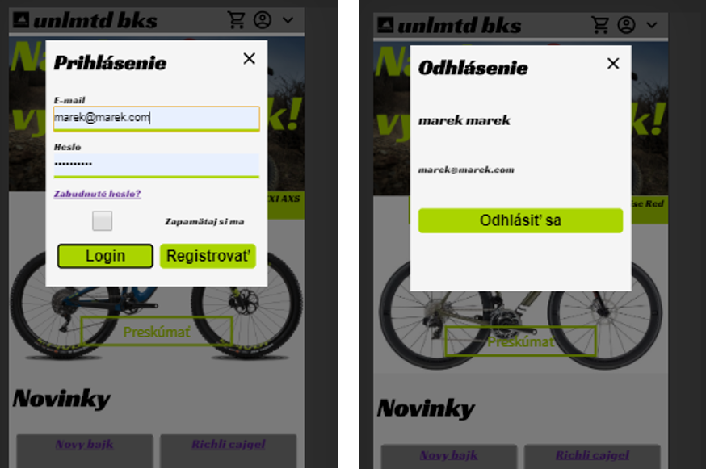

### Administrátorská časť

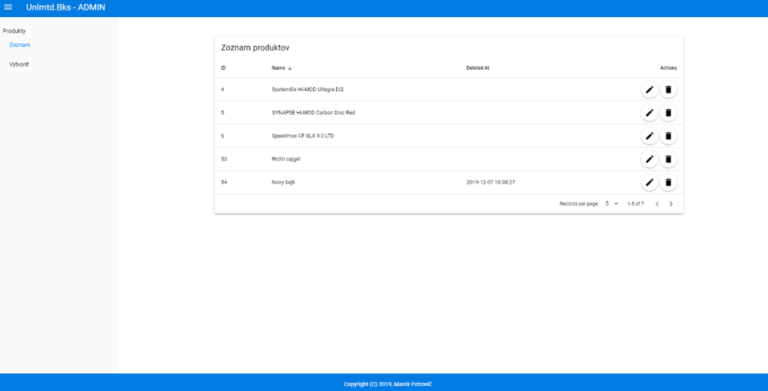
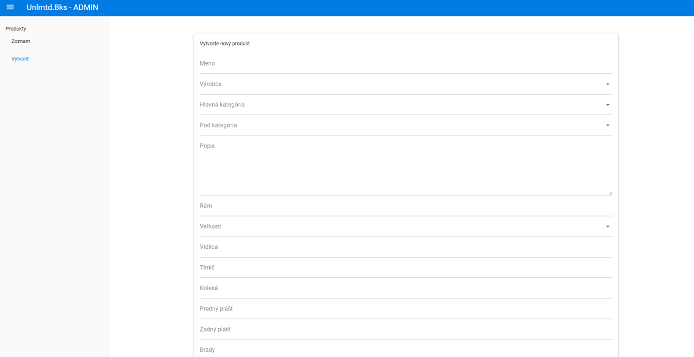
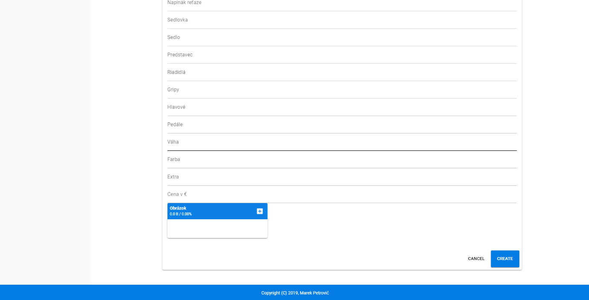
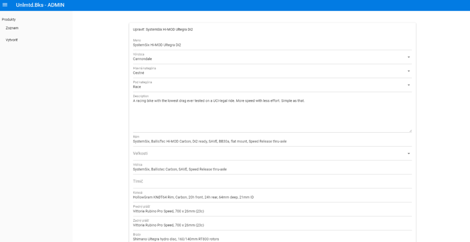
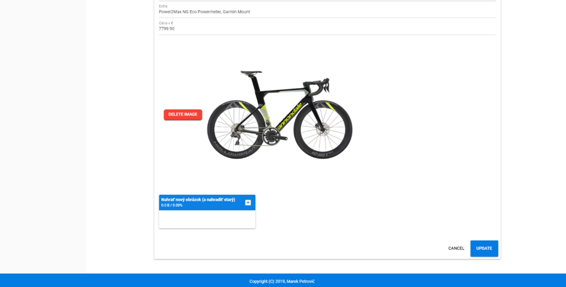

## Programovacie prostredie

Program som vypracoval v prostredí JetBrains PhpStorm.

Na klientskú časť som použil Laravel Framework verzie 6.5.0 a php verzie 3.01.

Na administrátorskú časť som použil Quasar vo verzii 1.2.4 a vue js vo verzii 2.6.10.

## Splnené požiadavky a komentáre k nim

### Klientská časť - 10 bodov
1. zoznam produktov - 3 body
* filter (order) 
  * filtrovanie podľa značky, veľkosti, kategórií
  * zoradenie podľa ceny vzostupne/zostupne, od najstarších, najnovších

Ako ukážka je získanie súborov z určitej kategórie podľa route, samozrejme vieme zobrazovať aj bez týchto dvoch kategórií. Toto je len najzložitejší prípad.
``` php
Route::get('/products/{maincat}/{subcat}', 'ProductsController@categories')
    ->where('maincat','[a-z]*$')
    ->where('subcat','[a-z]*$');
```

Vo funkcii sa zároveň aj spracováva filtrovanie podľa filtra. Ten získavame cez `$_GET` vytvorený filtrovacím formulárom.
```php
/**
     * Display a listing of SUB CATEGORY OF MAIN CATEGORY of the resources.
     *
     * @return \Illuminate\Http\Response
     */
    public function categories($maincat,$subcat)
    {

        echo 'categories';

        $main = MainCat::all()->where('route_name','=',$maincat)->first();
        $sub = Subcat::all()->where('route_name','=',$subcat)->first();

        $url = '/products/' . $main->route_name . '/' . $sub->route_name;

        $title = $main->name . ' -> ' . $sub->name;

        $makers = Maker::whereHas('product',function ($q) use ($main,$sub){
            $q->where('products.mainCat_id','=', $main->id);
            $q->where('products.subCat_id','=', $sub->id);
        })->get();

        $sizes = Size::whereHas('product',function ($q) use ($main,$sub){
                $q->where('products.mainCat_id','=', $main->id);
                $q->where('products.subCat_id','=', $sub->id);
            })->get();

        $maker = array();
        foreach ($makers as $m){
            array_push($maker,$m->name);
        }
        $size = array();
        foreach ($sizes as $s){
            array_push($size,$s->name);
        }
        if (!empty($_GET['vyrobca'])){
            $maker =  $_GET['vyrobca'];
        }
        if (!empty($_GET['velkost'])){
            $size =  $_GET['velkost'];
        }
        $order =  "asc";
        if (!empty($_GET['radenie'])){
            $order =  $_GET['radenie'];
        }

        if(!empty($_get['page'])){
            $order = $_get['ordering'];
        }


        $products = Product::with(['image','maincat','subcat','maker','sizes'])
            ->whereHas('maincat',function ($q) use ($maincat){
                $q->where('main_cats.route_name','=', $maincat);
            })->whereHas('subcat',function ($q) use ($subcat){
                $q->where('subcats.route_name','=', $subcat);
            })
            ->whereHas('maker',function($q)use($maker){
                $q->whereIn('makers.name',$maker);})
            ->whereHas('sizes',function ($q) use($size){
                $q->whereIn('sizes.name',$size);
            });

        switch ($order){
            case 'asc':
            case 'desc':
                $products = $products->orderBy('cena',$order)->paginate(2);
                break;
            case 'old':
                $products = $products->orderBy('updated_at','desc')->paginate(2);
                break;
            case 'new':
                $products = $products->orderBy('updated_at','asc')->paginate(2);
                break;
        }

        $url = '/products/' . $main->route_name;

        return view('products',['products' => $products,'sizes'=>$sizes,'makers'=>$makers, 'title'=>$title, 'url' => $url,
            'radenie' => $order,'vyrobca'=>$maker,'velkost'=>$size]);
    }

```

* strankovanie
  * Podporované
  * Aktuálne pre demonštráciu len 2 produkty na stranu (málo produktov v database), dá sa ľahko zmeniť v controlleri

```php
switch ($order){
            case 'asc':
            case 'desc':
                $products = $products->orderBy('cena',$order)->paginate(2);
                break;
            case 'old':
                $products = $products->orderBy('updated_at','desc')->paginate(2);
                break;
            case 'new':
                $products = $products->orderBy('updated_at','asc')->paginate(2);
                break;
        }
```

2. detail produktu - 2 body
* pridanie/odobratie z košíka
  * v detaile produktu sa dá pridať do košíka, odoberá sa v košíku

Cesta:
```php
Route::get('/products/{id}','ProductsController@show')
    ->where('id','[0-9]+');
```
Načíta celý produkt s veľkosťami, obrázkami, kategóriami, výrobcom
```php
    /**
     * Display the specified resource.
     *
     * @param  int  $id
     * @return \Illuminate\Http\Response
     */
    public function show($id)
    {
        $product = Product::with(['image','maincat','subcat','maker','sizes'])->find($id);
        return view('detail',['product' => $product]);
    }
```

3. košík - 4 body
* zmena množtsva
  * áno
* odobratie
  * áno
* doprava/platba
  * áno
* údaje (validácia)
  * áno

Pridatie do košíka:
Route:

```php
Route::get('/add-to-cart/{id}','ProductsController@addToCart')
    ->where('id','[0-9]+');
```

Kód:
```php 
  /**
     * Adds item to Session cart
     * Sent here by GET
     *
     * @param $id
     */
    public function addToCart($id){

        $product = Product::find($id);

        $velkost =  $_GET['velkost'];
        $pocet = $_GET['pocet'];

        if(!$product) {
            abort(404);
        }

        $cart = session()->get('cart');

        // if cart is empty then this the first product
        if(!$cart) {

            $cart = [ $id => [
                                $velkost => [ "pocet" => $pocet
                                    ]]
            ];

            session()->put('cart', $cart);

            return redirect()->back()->with('succes','Úspešne pridané do košíka');
        }

        // if cart not empty then check if this product exist then increment quantity
        if(isset($cart[$id][$velkost])) {
            $cart[$id][$velkost]['pocet'] += $pocet;


            session()->put('cart', $cart);

            return redirect()->back()->with('succes','Úspešne pridané do košíka');

        }

        // if item not exist in cart then add to cart with quantity
        $cart[$id][$velkost] = [
            "pocet" => $pocet,
        ];

        session()->put('cart', $cart);

        return redirect()->back()->with('succes','Úspešne pridané do košíka');
    }
```

Ostatné funkcie košíka nebudem pridávať, nakoľko sú dlhé, obsahujú rôzne oštrenia. Pridám len vytvorenie objednávky. 

Cesta:
```php
Route::get('/uspech','BasketController@success');
```

Kód:
```php
    public function success(){

        $cart_products = session()->get('cart');
        $cart_sum = session()->get('cart_sum');
        $cart_transport = session()->get('cart_transport');
        $one_time_user = session()->get('one_time_user');
        $cart_payment = session()->get('cart_payment');

        $transport = Transport::where('name','=',$cart_transport['typ'])
            ->where('cena','=',$cart_transport['cena']);


        $transport_id = Transport::select('id')->where('name','=',$cart_transport['typ'])
            ->where('cena','=',$cart_transport['cena'])->first();

        if ($transport_id ==null){
            redirect('/doprava');
        }

        $payment_id = Payment::select('id')->where('name','=',$cart_payment)->first();
        if ($payment_id ==null){
            redirect('/platba');
        }


        $data = $one_time_user;
        $onetime_id = Onetimeuser::create([
            'meno' => $data['meno'],
            'priezvisko' => $data['priezvisko'],
            'email' => $data['email'],
            'ulica_a_cd' => $data['ulica_a_cd'],
            'obec' => $data['obec'],
            'psc' => $data['psc'],
            'phone_number' => $data['phone_number'],
            ])->id;

        $user = null;
        $user_id = null;
        if(Auth::check()){
            $user = Auth::user();
            $user_id = Auth::id();
        }
        
        $cena = 0;
        foreach (array_keys($cart_products) as $id){
            foreach (array_keys($cart_products[$id]) as $sz){
                $prod = Product::select('cena')->find($id);
                $cen = $prod->cena;
                $pocet = $cart_products[$id][$sz]['pocet'];
                if($pocet < 0){
                    $pocet = -$pocet;
                }
                $cena +=  $cen*$pocet;
            }
        }

        $order_id = Order::create([
            'cena'=> $cena,
            'user_id'=> $user_id,
            'onetimeuser_id'=> $onetime_id,
            'payment_type'=> $payment_id->id,
            'transport_type' => $transport_id->id,
        ])->id;


        foreach (array_keys($cart_products) as $id){
            foreach (array_keys($cart_products[$id]) as $sz){
                OrderProduct::create([
                    'order_id' => $order_id,
                    'product_id' => $id,
                    'pocet' => $cart_products[$id][$sz]['pocet'],
                    'velkost' => $sz,
                ]);
            }
        }

        session()->forget('cart');
        session()->forget('cart_sum');
        session()->forget('cart_trasport');
        session()->forget('cart_payment');
        session()->forget('one_time_user');


        return view('/basket_succesfull',['user'=>$one_time_user,'order_id'=>$order_id]);
    }
```
Získa všetky údaje ze session, overí ich koreknosť (ak nesedí, buď vráti na daný krok v košíku, alebo upraví na podporované hodnoty) s databázou a ak všetko sedí, tak vytvorí novú objednávku.

4. zákazník - 1 bod
* registrácia, prihlásenie, odhlásenie
  * áno
    
        Všetky kroky registrácie, prihlásenia a odhlásenia sú vygenerované laravelom a upravené pre potreby mojich šablón, autentifikačný mechanizmus zostal nezmenený, taktiež podpora hashovania hesiel.

### admin časť - 7 bodov
1.	prihlásenie/odhlásenie - bonus 4b
2.	zoznam produktov - 1 bod
*	áno

        Pridaný stĺpec DELETED AT.

3.	pridanie produktu - 2 body
*	s uploadom obrázkov
    *	áno
    
        V back-ende po resizing obrázkov pre potrebu srcset, ľahšie zaťaženie dát na mobilných zariadeniach.
        Nepovolí vytvorenie produktu bez obrázka - núti administrátora vytvárať peknú stránku, dôveryhodne pôsobiacu.

*	aspoň jeden číselník (viem si zo select-u vybrať napr. farbu)
    *	áno 4

        Možnosť výberu výrobcu, veľkosti, hlavnej kategórie a jej subkategórií (tie závisia od výberu hlavnej kategórie). 
        Taktiež validácia dôležitých polí (cena, názov...)

4.	odobratie produktu - 1.5 boda
    
        Soft delete, kvôli potrebe zachovať pre objednávky

*	fyzické vymazanie obrázku
    *	áno

        Následne nahradenie obrázkom „žiadna fotka“, produkt je v stave soft-delete

5.	edit - 2.5 boda
*	s uploadom obrázkov
    *	áno

        Upload nahradí existujúci obrázok novým

*	zoznam obrázkov - s delete tlačídlom
    *	áno
    
        Po vymazaní nahradenie obrázkom „žiadna fotka“.


